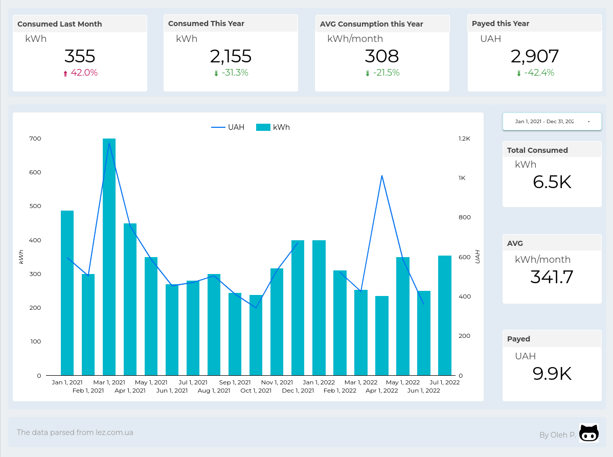

# lez-consumption
Monitoring of electricity consumption by households over time. The data is scraped from the website of the local energy company.

The project was created in order to try out the Selenium library.

Data is parsed from the energy company [site](https://lez.com.ua/), and then saved to a Google Sheet file. Visualized in Data Studio.

## Project output

## Credits
### Used libraries
- Selenium
- Pygsheet

Consumption and billing data parsed from [lez.com.ua](https://lez.com.ua/)
